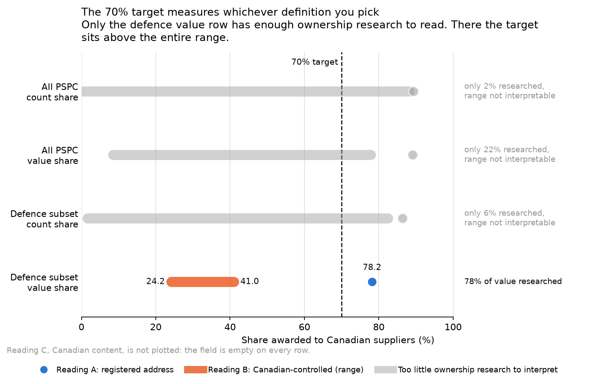
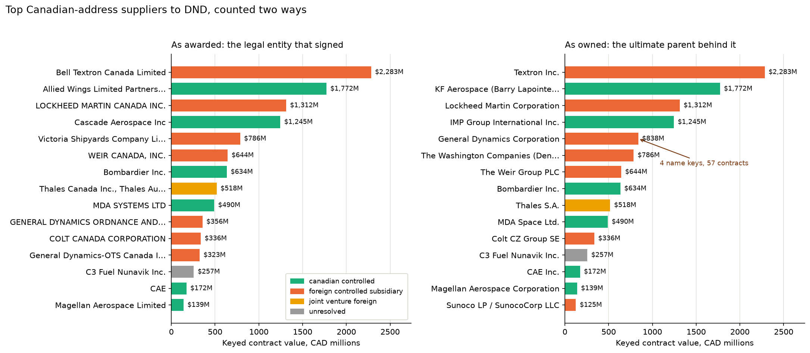

# Defence procurement: what the award data says about the 70% target

The Defence Industrial Strategy targets 70% of defence acquisitions going to
Canadian firms. I pulled the CanadaBuys contract award history, every PSPC award
and amendment published since June 2023, and measured what it says under each
defensible definition of "Canadian firm". The file is 21,890 rows and 91 columns
on the 2026-09-03 pull, and it had not changed on six pulls through 2026-09-04.
All numbers below come from `03_load_explore.ipynb` run top to bottom against
that file, whose hash is in `pull_manifest.json`.

Three things came out of it. The field that would answer the question is empty.
Two defects in the file each move the headline number by more than the target
is worth arguing about, before any definition is applied. And once both are
fixed, the answer depends entirely on which definition you pick: the same
defence subset reads 78% Canadian under one defensible definition and somewhere
between 24% and 41% under another.

## The field that would answer the question is empty on every row

The file carries a column for the percentage of goods by country of origin,
which the publisher defines as "the percentage of the total of the manufactured
goods, by country of origin". That is the reading the Strategy most plausibly
intends: not where the supplier's mail goes, but where the work is done.

It is populated on 0 of 21,890 rows (A15). So Canadian content cannot be
measured from this file at all, and it is reported below as a row in the
sensitivity table rather than dropped, because the emptiness is the finding.
Everything that follows measures registered address or ownership instead, and
neither of those is capability.

## Two defects move the number before any definition does

### Summing the value column doubles the file

The file has one row per contract amendment, not one per contract. 13,296
contracts sit across 21,890 rows, and 4,314 of them have been amended at least
once. The total contract value, which the publisher defines as "the cumulative
total value of a contract, from contract award date to present", is printed
unchanged on every amendment row of a contract. It never varies within a
contract (A21 finds 0 that do), so it is not being restated, it is being
repeated.

Summing it the obvious way therefore double-counts every amended contract:

| | Value |
| --- | ---: |
| Naive sum over every row | $132,853,897,948.13 |
| Keyed sum, one row per contract at its latest amendment | $66,363,740,301.42 |
| Overstatement | $66,490,157,646.71, or 100.2% |

One contract makes the point. CW2340003 is the largest award in the defence
subset, and its total appears three times:

| Amendment | Total contract value | Amendment amount | Award date |
| --- | ---: | ---: | --- |
| 000 | $2,283,021,216.00 | $2,283,021,216.00 | 2023-12-15 |
| 001 | $2,283,021,216.00 | null | 2023-12-15 |
| 002 | $2,283,021,216.00 | $0.00 | 2023-12-15 |

Add up the left column and this one contract contributes $6.8B to a total it is
worth $2.3B in. The fix is a keyed dedup: one row per reference number, the
highest amendment winning. Taking the maximum per contract happens to return the
same $66,363,740,301.42, but only because the column is constant within a
contract, which is an accident of how the file was denormalised rather than a
rule to build on.

### The country field is coded two ways

Supplier country is written as `CA` on 18,315 rows and as `Canada` on 1,488, and
the same is true of every other country with both a code and a name in the file.
Filtering on the literal `Canada`, which is what the column looks like it holds
if you read the first rows that carry a name, gives 15.36% of value to Canadian
suppliers. Accepting either spelling gives 89.13%. Resolving all 49 distinct raw
values through a published crosswalk also gives 89.13%, so the crosswalk changes
nothing for Canada and exists so the other 47 values are resolved the same way,
and so the resolution is a file someone can read rather than a query nobody will.

The dual coding is a migration, not noise. Rows written `Canada` run 801, 329,
87 and 0 by award year from 2023 to 2026, while rows written `CA` run 4,706,
6,165, 4,905 and 2,539. Of the 305 undated rows, 271 are written `Canada` and
none is written `CA`.

One row is the literal string `N/A`. Its supplier appears under exactly one real
country elsewhere in the file, so that country is borrowed, recovering $654.9M
for one German supplier. The borrow is published as its own one-row file.
Three rows are blank and stay unknown.

### A third defect cannot be fixed at all

The amendment-grain value column, which the publisher defines only as "the
monetary value of the awarded contract", has no single meaning across the file.
Tested on every amended contract where every row carries an amount and the total
is non-zero, 2,168 contracts:

| Reading | Contracts | Share | Value |
| --- | ---: | ---: | ---: |
| neither | 866 | 39.9% | $11,972.5M |
| increment per amendment | 855 | 39.4% | $4,067.1M |
| both, one row carries the whole total | 353 | 16.3% | $998.0M |
| restatement of the contract | 94 | 4.3% | $88.9M |

The publisher's own row type, added to the file in spring 2026, explains most of
the largest group. 2,686 contracts have no row typed Original: the file holds
their amendments but never recorded the award they amend, so the amounts it does
hold cannot add up to the total by construction. $10,400.0M of the $11,972.5M in
the neither group sits on those contracts. But even where every row is present,
568 of 1,568 testable contracts fit neither reading, so no rule reads the column
correctly and no sum of it is reported anywhere in this project. The
publisher's restructuring notes acknowledge "unintended duplication of previous
contractAmount values in records associated with purely administrative changes",
which is consistent with what the test finds.

## The sensitivity table

Three readings of "Canadian firm", two scopes, two measures. Value shares
exclude the one negative contract and the $0 rows, which add nothing; count
shares keep the $0 rows, since a $0 award was still awarded to somebody.

- **Reading A, registered address.** The supplier's address resolves to Canada.
- **Reading B, Canadian-controlled.** Reading A minus Canadian-registered
  subsidiaries and joint ventures of foreign parents, from a published crosswalk
  of the suppliers covering 80% of Canadian-address defence value. Reported as a
  range: the lower bound counts the unresearched tail as foreign, the upper bound
  counts it as Canadian. No point estimate, and no extrapolation from the
  researched set onto the tail.
- **Reading C, Canadian content.** Not computable. The field is empty.

| Scope | Measure | Reading A | Reading B | Control coverage | Reading C |
| --- | --- | ---: | ---: | ---: | --- |
| All PSPC | value | 89.13% | 8.43% to 77.87% | 22.08% | empty |
| All PSPC | count | 89.31% | 0.50% to 88.22% | 1.78% | empty |
| Defence subset | value | 78.17% | 24.16% to 41.04% | 78.41% | empty |
| Defence subset | count | 86.39% | 1.56% to 82.44% | 6.38% | empty |

Control coverage is the share of Canadian-address value whose ownership was
actually researched, and it decides which rows can be read. The crosswalk
researched defence suppliers, so in the other three rows almost nothing has a
control class and the reading B range is arithmetic rather than evidence.
Those rows are drawn in grey on the chart with the reason beside them.

The one readable row is the defence value row. There, reading A clears the 70%
target by eight points and reading B sits entirely below it, with its upper
bound 29 points short. The two defensible readings of the same money on the same
contracts are 37 to 54 points apart. The Strategy does not publish which
definition it means, so this table brackets the answer and cannot pick it.

### What the defence subset is

No row names National Defence as the contracting entity; this is a PSPC file
and PSPC is the contracting entity on every row (A11). The subset is therefore
built from the end-user field: a contract is in it if that field mentions the
Department of National Defence or Defence Research and Development Canada. It
has to be a substring test, because one cell can list up to 25 bodies separated
by slashes and an exact match catches only the 374 rows where defence appears
alone, against 4,229 for the substring. 155 of the 341 distinct end-user
strings qualify.

That gives 2,756 contracts worth $19,878,465,949.91. It is not exclusive
departmental spending: 217 of the end-user strings name more than one body, so
the subset overlaps other departments. And it is a subset of a subset, because
departments that contract directly, including DND itself, are not in a PSPC file
at all.

### Offers to supply are in the file as contracts

The publisher's instrument type, another column added in spring 2026, says that
4,239 of the 13,296 "contracts" are standing offers or supply arrangements:
offers to supply at a price, not awards of money. That is where the file's
quarter of zero-value rows comes from. 95.2% of supply arrangements and 65.2%
of standing offers carry a $0 total, 3,360 of the 3,665 zero-value contracts
between them (A24).

Whether an offer counts as an acquisition is a definitional call I have not
made for the reader. Measured both ways on the defence subset:

| Defence subset | Contracts | Value | Reading A | Reading B | Coverage |
| --- | ---: | ---: | ---: | ---: | ---: |
| All instruments | 2,280 | $19,878.5M | 78.17% | 24.16% to 41.04% | 78.41% |
| Without offers | 1,897 | $18,346.1M | 76.42% | 24.31% to 37.79% | 82.36% |
| Offers only | 383 | $1,532.4M | 99.09% | 22.37% to 79.96% | 41.88% |

The offers are 7.7% of defence value and sit almost entirely at Canadian
addresses, so excluding them takes 1.75 points off reading A and narrows the
reading B range from above. That is real and worth stating. It is not the
definitional swing the table above is about.

## Who the Canadian-address defence suppliers are

Suppliers were researched in value order until the running share of
Canadian-address defence value crossed 80%, which landed at 28 suppliers on
this pull and covers 80.06% of that value (A19). The other 1,059 suppliers
default to unresolved rather than being assumed Canadian, which is what makes
reading B a range. Of the 28: 15 are foreign-controlled subsidiaries worth
$6,802.4M, 10 are Canadian-controlled worth $4,802.0M, 2 are joint ventures
with a foreign parent worth $579.4M, and 1 was researched and came back
genuinely unresolved, $257.0M. Every row carries its source, its check date and
a confidence grade; five are graded medium and named in the crosswalk.

The same fifteen suppliers ranked two ways, at the legal entity that signed and
at the ultimate parent behind it:

| Rank | Legal entity | Control | Contracts | Value |
| ---: | --- | --- | ---: | ---: |
| 1 | Bell Textron Canada Limited | foreign subsidiary | 1 | $2,283.0M |
| 2 | Allied Wings Limited Partnership | Canadian-controlled | 1 | $1,772.4M |
| 3 | Lockheed Martin Canada Inc. | foreign subsidiary | 6 | $1,311.9M |
| 4 | Cascade Aerospace Inc | Canadian-controlled | 1 | $1,245.2M |
| 5 | Victoria Shipyards Company Limited | foreign subsidiary | 1 | $786.1M |
| 6 | Weir Canada, Inc. | foreign subsidiary | 1 | $643.9M |
| 7 | Bombardier Inc. | Canadian-controlled | 1 | $634.0M |
| 8 | Thales Canada and Thales Australia in joint venture | foreign joint venture | 1 | $517.5M |
| 9 | MDA Systems Ltd | Canadian-controlled | 7 | $490.4M |
| 10 | General Dynamics Ordnance and Tactical Systems - Canada Inc. | foreign subsidiary | 33 | $356.0M |
| 11 | Colt Canada Corporation | foreign subsidiary | 20 | $336.1M |
| 12 | General Dynamics-OTS Canada Inc. | foreign subsidiary | 19 | $323.1M |
| 13 | C3 Fuel Nunavik Inc. | unresolved | 3 | $257.0M |
| 14 | CAE | Canadian-controlled | 5 | $172.5M |
| 15 | Magellan Aerospace Limited | Canadian-controlled | 4 | $139.2M |

| Rank | Ultimate parent | Control | Name keys | Contracts | Value |
| ---: | --- | --- | ---: | ---: | ---: |
| 1 | Textron Inc. | foreign subsidiary | 1 | 1 | $2,283.0M |
| 2 | KF Aerospace (Barry Lapointe Holdings) | Canadian-controlled | 1 | 1 | $1,772.4M |
| 3 | Lockheed Martin Corporation | foreign subsidiary | 1 | 6 | $1,311.9M |
| 4 | IMP Group International Inc. | Canadian-controlled | 1 | 1 | $1,245.2M |
| 5 | General Dynamics Corporation | foreign subsidiary | 4 | 57 | $837.6M |
| 6 | The Washington Companies | foreign subsidiary | 1 | 1 | $786.1M |
| 7 | The Weir Group PLC | foreign subsidiary | 1 | 1 | $643.9M |
| 8 | Bombardier Inc. | Canadian-controlled | 1 | 1 | $634.0M |
| 9 | Thales S.A. | foreign joint venture | 1 | 1 | $517.5M |
| 10 | MDA Space Ltd. | Canadian-controlled | 1 | 7 | $490.4M |

General Dynamics is the row that moves. Its awards arrived under four separate
legal names, each of which reads as a moderate supplier at entity grain, ranks
10 and 12 among them. Grouped by owner it is the fifth-largest supplier of the
subset at $837.6M across 57 contracts. Nothing about the money changed between
the two tables, only the question being asked.

Two things to read into that chart with care. The second bar, Allied Wings, is
graded medium confidence: it is a limited partnership led by KF Aerospace and
the Canadian-controlled call rests on the lead partner, since the other partners
are not confirmed. It is also the one large contract in the subset with no award
date. And the consolidation that reorders the right panel is a lower bound. The
parent grain can only merge what was researched, and the 1,059 suppliers outside
the crosswalk each fall back to being their own parent, so shared ownership
among them is invisible by construction.

## Spend analysis by capability segment

The Strategy names ten sovereign capabilities. Three of them can plausibly be
found in a procurement file: aerospace, uncrewed and autonomous systems, and
specialized manufacturing. The first attempt to find them was a keyword search
across the title and description fields, kept in the notebook because it fails:
"carbon fib" matches 0 rows, "composite" 20, "aerospace" or "aircraft" 252, and
the uncrewed vocabulary 75. Segments cannot be defined by searching text in
this file, so they are defined by UNSPSC code through a published crosswalk of
350 code prefixes, 238 at family grain and 112 at class grain, where a class tag
overrides its family.

### The classification is missing exactly where the money is

45.1% of defence value, $8,968.5M on 260 contracts, carries no UNSPSC code at
all. Those 260 contracts average $34.5M against $4.4M for the ones that do carry
a code. So the segment shares below describe $10,909.9M, a bit over half the
subset, and they describe the half made of smaller contracts.

The publisher's new columns say why. The rows with no UNSPSC code, no
instrument type and no amendment type are the same 1,762 rows, and none of them
carries a CanadaBuys `CW` reference number. They are records carried over from
the procurement system that preceded CanadaBuys, kept in this file because their
amendments continue, and every undated row in the file is one of them (A26). In
the defence subset they are 290 contracts worth $10,889.4M, 54.8% of the value,
and all 260 unclassified contracts are among them. The gap is not a coding lapse
scattered through the file. It is the old system's records, and they are the
large, long-running contracts.

### Shares of classified defence value

| Segment | Contracts | Value | Share | Reading A | Reading B | Coverage |
| --- | ---: | ---: | ---: | ---: | ---: | ---: |
| aerospace | 49 | $4,308.2M | 39.49% | 97.5% | 43.6% to 44.5% | 99.1% |
| specialized manufacturing | 80 | $1,826.4M | 16.74% | 53.1% | 1.6% to 4.6% | 94.3% |
| uncrewed and autonomous | 20 | $2.1M | 0.02% | 35.3% | not interpretable | 0.0% |
| other | 2,347 | $4,773.2M | 43.75% | 96.1% | not interpretable | 34.8% |
| unclassified | 260 | $8,968.5M | | 64.4% | 25.9% to 28.9% | 95.3% |

Three things to say out loud about that table.

**The aerospace number is one contract.** Bell Textron's rotary wing
maintenance contract, the $2,283,021,216.00 award shown earlier, is 53.0% of
the aerospace segment on its own, 20.9% of all classified defence value and
11.5% of the whole subset. Aerospace is not a broad base of Canadian aerospace
work; it is one award to the Canadian subsidiary of a US company plus a tail.

**Uncrewed and autonomous systems are effectively absent.** $2.1M across 20
contracts. One of the three capabilities that this file could speak to has
almost nothing in it to measure, and it would have disappeared entirely had the
crosswalk stopped at family grain, because the UAV class sits inside the
aircraft family and would have been booked as aerospace. That is why the
crosswalk carries class rows at all.

**Aviation fuel is in other, on purpose.** The fuels family is $1,208.2M, 11.1%
of classified value, almost all of it aviation fuel bought for aircraft. It
would have been the second-largest line in aerospace and made fuel a fifth of
the aerospace number. It is fuel, not aerospace capability, so it is tagged
other, and the reader who disagrees can retag one row in the crosswalk.

Two approximations sit under the segment shares, both measured. Where a
contract carries several UNSPSC codes, and 6,866 rows do, up to 29 on one row,
the first is taken as primary. 90.3% of classified defence value sits on
single-code contracts, so the approximation touches the remaining 9.7%.
And a UNSPSC family is a container rather than a category: the aircraft
maintenance family is 99.7% aircraft maintenance by value but also holds truck
repair and ship refits, so seven class rows are carved back to other,
reassigning $37.91M.

### Concentration, at two grains

Concentration is measured once at the legal entity that signed and once at the
ultimate parent behind it. HHI is the sum of squared value shares times 10,000.

| Segment | Entities | HHI entity | Top 1 | Top 3 | Parents | HHI parent | Top 3 | Gap |
| --- | ---: | ---: | ---: | ---: | ---: | ---: | ---: | ---: |
| aerospace | 41 | 3,864 | 53.0% | 96.6% | 41 | 3,864 | 96.6% | 0 |
| specialized manufacturing | 36 | 2,138 | 37.9% | 71.3% | 34 | 2,446 | 79.9% | 308 |
| unclassified | 78 | 1,051 | 19.8% | 49.1% | 78 | 1,051 | 49.1% | 0 |
| other | 1,169 | 219 | 10.8% | 19.8% | 1,169 | 219 | 19.8% | 0 |
| uncrewed and autonomous | 18 | 4,921 | 64.7% | 100.0% | 18 | 4,921 | 100.0% | 0 |

Specialized manufacturing is the only segment where the parent grain changes
anything, and the change is General Dynamics: four legal names collapsing into
one parent moves its HHI from 2,138 to 2,446 and its top-three share from 71.3%
to 79.9%. A gap of 0 elsewhere means nothing was found, not that nothing is
there, for the reason given above: the parent grain can only merge what was
researched. The uncrewed row is arithmetic on $2.1M and 20 contracts, and
should not be read as a concentration finding.

## Definitions

| Term | How it is measured | What is excluded |
| --- | --- | --- |
| Contract | One reference number, valued at its highest-numbered amendment row. 13,296 in the file. | Nothing at this step. The 55 non-numeric amendment codes sort first; moving them last changes 0 contracts. |
| Keyed value | The total contract value on that surviving row. $66,363,740,301.42 across all PSPC. | The one negative contract, quarantined at A6. |
| Naive value | The total contract value summed over every row. Shown only as the wrong answer. | Same negative row. |
| Defence subset | Contracts whose end-user field mentions DND or DRDC. 2,756 contracts, $19,878,465,949.91. | Nothing else. Includes contracts shared with other departments. DND's own direct contracting is not in a PSPC file. |
| Value share | Share of keyed value. | $0 contracts, 3,665 of them, most of them offers to supply. |
| Count share | Share of contracts. | Nothing. $0 contracts are counted. |
| Reading A | Value or count where the supplier's address resolves to CA through the country crosswalk. | The one contract whose country cannot be resolved. |
| Reading B, lower | Reading A restricted to suppliers researched as Canadian-controlled. | Everyone unresearched, counted as foreign. |
| Reading B, upper | Reading A restricted to suppliers researched as Canadian-controlled or not researched at all. | Foreign subsidiaries and foreign joint ventures. |
| Reading C | Percentage of goods by country of origin. | Not computable. The field is empty on every row. |
| Control coverage | Share of Canadian-address value in the row whose ownership was researched. Reading B is only read above 50%. | |
| Segment | The first UNSPSC code on the contract, resolved class first and family second through the segment crosswalk, default other. | Contracts with no code are unclassified, not other. |
| Concentration | HHI and top-share over positive-value contracts within a segment, at entity grain and at parent grain. | $0 contracts. |
| Offers | Standing offers and supply arrangements by the publisher's instrument type. | Reported as a sensitivity line, not removed from any table above. |
| Date-based cuts | Award date on the surviving row. | 285 undated contracts, all legacy-format records. |

## What this cannot tell you

- **Whether any supplier manufactures in Canada.** Address is not capability, and
  the one field that would speak to it is empty on every row.
- **What "defence acquisitions" means in the target's denominator.** This file is
  PSPC only. Departments that contract directly, DND included, are absent. The
  defence end-user subset is the best available proxy and it is a subset of a
  subset, and it overlaps other departments.
- **Which definition of "Canadian firm" the government will use.** The Strategy
  does not publish one. The sensitivity table brackets the answer; it cannot
  pick it.
- **Whether awarded value was spent.** Award value is not expenditure. Contracts
  are amended down, terminated, 38 rows here, and under-drawn. Standing offers
  in particular are ceilings, not commitments.
- **What the amendments were worth.** The amendment amount column has no single
  meaning and is not aggregated anywhere in this project.
- **How much of the value is really "since June 2023".** The total is cumulative
  from the original award, and 2,686 contracts have no original row in the
  file, so some of their value predates the window. The file does not say how
  much.
- **Anything about a trend toward 2036.** Three years of award dates cannot
  support a ten-year trajectory.
- **Who controls the tail.** The control crosswalk is a judgement on 28
  suppliers at one point in time, sourced and dated. Ownership changes, and the
  1,059 suppliers outside it are reported as a range, not resolved.

## Data quality suite

Every rule is one query that returns the rows that fail it. BLOCK stops the
notebook; WARN is flagged and carried; NOTE is on the record. Expected values
are written at the call site so a re-pull that changes shape is obvious.

| Id | Severity | Rule | Expected | Failing | Decision |
| --- | --- | --- | --- | ---: | --- |
| A1 | BLOCK | duplicate (reference_number, amendment_number) | 0 | 0 | stop if any |
| A2 | BLOCK | rows rejected at load | at most 4 | 0 | stored, counted, carried |
| A3 | WARN | amendment_number not three digits | 55 | 55 | non-numeric codes sort first; measured both ways, 0 contracts change |
| A4 | WARN | raw value or date non-empty but typed cast is null | 0 | 0 | inspect if any |
| A5 | WARN | contract value is $0 | 5,502 | 5,502 | keep, flag, exclude from value shares; mostly offers, see A24 |
| A6 | BLOCK | contract value below $0 | 1 | 1 | quarantine, exclude from value |
| A7 | NOTE | contract value above $100M | 115 | 115 | keep, eyeball top 20 |
| A8 | WARN | latest row is $0 while an earlier amendment is above 0 | measure | 0 | keyed value kept |
| A9 | BLOCK | country value not covered by the country crosswalk | 0 | 0 | extend the crosswalk until 0 |
| A10 | WARN | country is the literal N/A | count | 1 | resolve by same-name rule, else unknown |
| A11 | WARN | contracting entity is not PSPC | 0 | 0 | documents scope |
| A13 | WARN | UNSPSC code null | about 1,762 | 1,762 | segment unclassified; every one is a legacy record, see A26 |
| A14 | NOTE | GSIN code null | about 91.7% | 20,082 | not used |
| A15 | NOTE | percentage of goods by country null | 21,890 | 21,890 | reading C not computable |
| A16 | NOTE | standardized supplier name null | about 76.8% | 16,814 | not used |
| A17 | WARN | award date outside 2023-06-01 to today | 0 | 0 | inspect if any |
| A18 | WARN | currency not CAD | 0 | 0 | inspect if any |
| A19 | WARN | control crosswalk coverage of Canadian-address defence value | at least 80% | 80.06%, 1,059 suppliers outside | report the shortfall as the width of the reading B range |
| A20 | WARN | award date null | 305 | 305 | kept, excluded from date-based cuts; all legacy records, see A25 and A26 |
| A21 | NOTE | total contract value varies within a contract | 0 | 0 | grain mismatch confirmed, the total is repeated, not restated |
| A22 | NOTE | contract carries more than one UNSPSC code | measure | 6,866 | first code taken as primary |
| A23 | WARN | supplier legal name null or blank | 1 | 1 | kept under an explicit blank supplier key |
| A24 | WARN | instrument is a standing offer or supply arrangement | measure | 6,519 | kept, flagged, effect reported beside the sensitivity table |
| A25 | NOTE | contract has no Original row in the file | measure | 2,686 contracts | kept; explains most of the value the neither reading could not |
| A26 | WARN | legacy-format reference number | measure | 2,343 | kept; the population behind the unclassified segment and the undated rows |

A12 is a lookup rather than a rule: it lists every end-user string that mentions
defence in either language, and the subset is built from that list.

## What is in the folder

- `03_load_explore.ipynb`, every query, both charts, the assertion suite.
- `crosswalks/`, the five published mappings: country, the N/A borrow, supplier
  control, supplier name groups, and UNSPSC segments. Each merges on rebuild and
  never overwrites a reviewed value.
- `memo/decisions.md`, every choice a reader could reasonably have made
  differently, with the measurement that settled it.
- `memo/pitfalls.md`, the places where the obvious code returns a plausible
  wrong number against this file.
- `memo/data_contract.md` and `memo/source_to_target.md`, what was pulled and
  how every column was handled.
- `powerbi/`, the star schema behind the same numbers, with the DAX measures.
