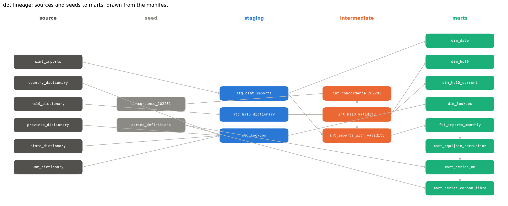

# 05: Additive Manufacturing Trade Reconstruction

Every one of the nine HS10 codes for additive manufacturing machines and parts in Canada's import tariff begins in January 2022. Before that month the codes did not exist, and one of them, 8485100000, spent 1988 to 2006 meaning ships' propellers. So a growth figure that starts from 2021 is dividing by a baseline that was never measured, and any join of trade values to the current code descriptions rewrites history for every code that changed meaning. This project rebuilds the monthly import series from 1988 to 2026 with the code dictionary's own validity ranges, measures how much value a naive join misattributes, and reports the post-2022 growth three ways with the spread between them as the finding.

**Status:** Analysis complete. Dashboard notes written, the model itself not yet built.

**Data:** Statistics Canada, Canadian International Merchandise Trade, the eight open.canada.ca packages covering 1988 to July 2026 (`data/cimt/`, gitignored). One imports zip per year, 39 in all, each carrying the HS10 monthly file by partner country, province of clearance and US state, plus the fixed-width HS10 dictionary with a validity start and end on every code description. 186,229,882 rows across 463 months, 15,970 billion nominal dollars. Pulled 2026-09-05 and 2026-09-06; the run log with every zip's hash is `python/run_log.csv`. Statistics Canada's ten-digit concordance for the January 2022 tariff, published by the border agency, pulled 2026-09-07. Open Government Licence, Canada.

**The question:** How much of the reported rise in Canadian additive-manufacturing imports since 2022 is real growth, and how much is a classification artifact?

**How the pipeline is built:** A backfill script pulls the yearly zips, converts the one file needed to Parquet with every column as text, verifies the row count, keeps each distinct dictionary snapshot under its hash and writes a thirteen-column run log. It is batch engineering with a log, not a running production system, and it is claimed as exactly that: idempotent, so a year already on disk with a matching count is skipped, and a publisher answering a missing file with a web page at HTTP 200 is refused before a byte is written. A dbt Core project on DuckDB stages the Parquet and the dictionary, builds a validity-range dimension from the publisher's own start and end months, and joins imports to descriptions on the month falling inside the range rather than on the code alone. The fact table is incremental by year. Two committed crosswalks are its seeds: the publisher's concordance across the 2022 break and the definitions of every series. 87 checks run on every build, 2 seeds, 14 models and 71 tests, in three minutes. The notebook takes over for the statistics.

**Key finding:** A join on the code alone would misdescribe 8.49% of import value across 1988 to 2026 and lose another 35.24% under codes that no longer exist, and in 1988 it would get 89.13% of the year wrong. Joined on the code and the month, every one of 186 million rows lands on exactly one meaning. On that footing, imports under the nine 3D-printing codes rose from $49.5M in 2022 to $116.1M in 2025, 134.8%, a figure with nothing before it to compare against. The seventeen codes the printers came from, named by the publisher's own concordance, are fifty times larger and show no fall at the break; the one that does, plastics machinery, gave up about a quarter of its level, which bridges the plastics printers back to a 2021 level of $26.0M against $62.7M in 2025, 141.7% with a bootstrap interval of 36% to 1,463%. The combined basket, whose goods do not change at the break, grew 48.1% over the same years. Carbon fibre has five stretches under four regime labels between 1988 and 2026 and cannot be read as one series at all.

**The trap in the source:** The dictionary is a fixed-width text file, 53,570 lines of 213 characters, Windows-1252, with eight fields rather than the six the handoff described, and it is a snapshot per zip rather than one file. 5,962 of its 42,771 codes have carried more than one meaning. The rule this project first planned for mapping codes across the 2022 break, pair a retired code with new codes in its own subheading or heading, would have found nothing for heading 8485, which had no live code in 2021, and would have missed 876 of the 2,083 pairs the publisher actually drew. Details in `memo/findings.md` and `memo/decisions.md`.

**What the tests say:** The Chow test at January 2022 does not reject one line for the donor basket (F 1.46, p 0.158); a rolling Chow scan, named as such and used as a locator only, puts the donor basket's break in January 2025 and the plastics donor's in August 2021. The interrupted time series with Newey-West errors finds negative level shifts in three donors, all in the rubber and plastics machinery heading, and none in the basket. The bridged growth estimate for the whole basket is therefore reported as undefined, with 1,266 of 2,000 bootstrap replicates giving no negative shift, rather than as a number.

**Charts:** `am_imports_three_estimates.png`, the recipient basket as published, the plastics printers with their backcast before 2022 and its band, the combined basket beneath, and the three estimates written on the figure. `carbon_fibre_regimes.png`, 1988 to 2026 with the five stretches shaded and the epoxide sheet series on its own panel.

**Memo:** `memo/findings.md` for the results and what they cannot say, `memo/decisions.md` for the design decisions and what would reverse each, `memo/data_contract.md` for the three sources and their defects, `memo/source_to_target.md` for every column read and the check that guards it.

**Crosswalks:** `crosswalks/concordance_202201.csv`, the publisher's 2,507 pairs with source and pull date on every row; `crosswalks/concordance_202201_with_descriptions.csv` for review; `crosswalks/series_definitions.csv`, which codes make up each series over which months, with the rule and source per row.

**Power BI:** `powerbi/README.md` carries the star with the validity dimension, the temporal-join and naive-join measures side by side, the corruption measures, the regime slicer and the row-level security role by province of clearance. The notebook exports the nine tables it is built from.

**Stages:**
- [x] Check the sources: the eight packages, the file grain, the dictionary layout, the libraries
- [x] Backfill 1988 to 2026 to Parquet with a run log
- [x] dbt project: staging, validity dimension, temporal join, incremental fact, tests, docs
- [x] Concordance across the 2022 break and the equijoin corruption measure
- [x] Break tests, interrupted time series, three growth estimates
- [x] Charts and findings memo
- [x] Star export and Power BI notes
- [ ] Power BI model

**Reproduce:** from the repo root, create the venv and `pip install -r requirements.txt`, then run `05_load_explore.ipynb` top to bottom. The first run downloads about 2.4 GB of zips into `data/cimt/` and converts them, which took a quarter of an hour on this machine; every later run skips what is on disk. The dbt project can also be run on its own from `05-additive-trade/` with `dbt build --project-dir dbt --profiles-dir dbt`, given the two environment variables the notebook sets, `CIMT_DUCKDB` for the database file and `CIMT_DATA` for the data folder; `dbt docs generate` and `dbt docs serve` with the same flags open the documentation site.

**Environment:** Python 3.14, DuckDB 1.5, dbt Core 1.12 with the duckdb adapter 1.11, pandas, pyarrow, statsmodels, scipy, matplotlib, openpyxl for the concordance spreadsheets.
