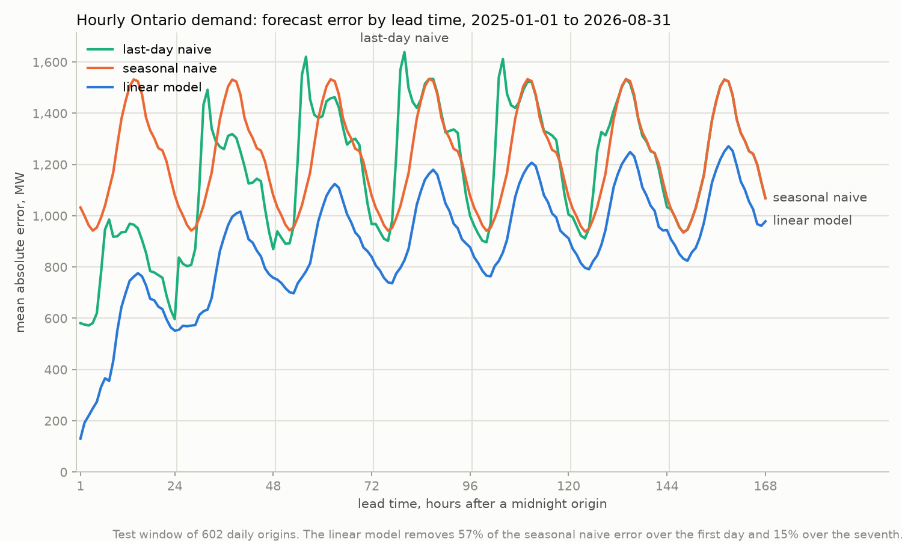
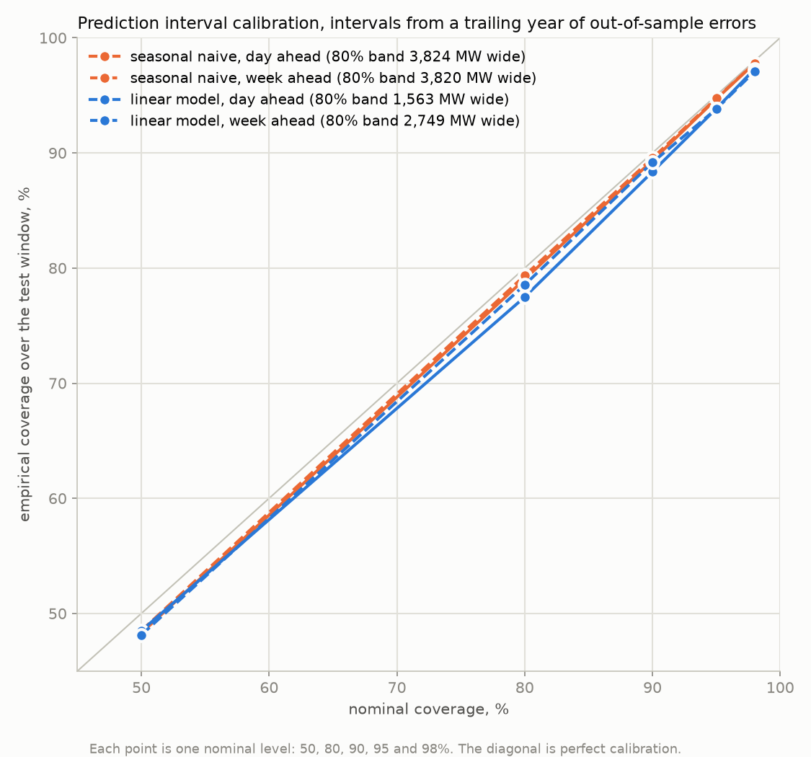

# 06: Ontario Demand Forecast with an Honest Baseline

Forecasting Ontario's hourly electricity demand is a well-worn exercise, and most write-ups
skip the two questions that decide whether a forecast is worth anything: how much better is
it than the dumbest forecast a person would make, and when it says 80% sure, is it right 80%
of the time. This project answers both on a rolling-origin backtest, with no weather input,
and then asks who would act on the forecast and what its error costs them in their own
units.

**Status:** Analysis complete on the 2026-09-06 pull. Notebook, crosswalk, charts and memos
done. Power BI model next.

**Data:** IESO hourly Ontario demand, one CSV per year from 2002 to 2026, pulled from the
IESO's public report server into `data/ieso/` with a manifest of bytes, hashes and the
publisher's own timestamps. Zonal demand from 2003 for the dashboard. Public reports under
the IESO's terms of use.

**The question:** Issued once a day at midnight for the next 168 hours, how far can a
transparent model with no weather in it beat the same-hour-last-week forecast, at a day
ahead and a week ahead? Are its prediction intervals calibrated? And for a large consumer
deciding whether to curtail tomorrow, is the day-ahead error small enough to tell a
top-five peak day from the day that just misses?

**How the backtest is set up:** Every day from January 2025 to the end of August 2026 is an
origin. Two baselines and one model forecast the next seven days from each origin: the
seasonal naive (same hour, same weekday, one week earlier), a last-day naive (the origin
day repeated), and one least squares regression per lead on sixteen things known at the
origin: last week, yesterday, the current level, the target day's type, the season. The
model refits every four weeks on the five years before it. Prediction intervals come from
each lead's own out-of-sample errors over the trailing year, and the year before the test
window exists only to supply them. Skill is the share of the baseline's error the model
removes; a Diebold-Mariano test with an overlap correction says whether the gap is real;
coverage is measured against nominal at five levels, by lead and by month.

**Key finding:** A day ahead, the model misses by 523 MW on average, 3.0% of demand, against
1,221 MW for the same-hour-last-week forecast, so it removes 57% of the baseline's error. A
week ahead it removes 15%, 1,029 MW against 1,214, and at midnight on the seventh day the two
cannot be told apart (Diebold-Mariano 1.4, p = 0.17). Its 80% interval is 1,563 MW wide and
covers 77.5% of hours; the baseline's covers 79.0% at 3,824 MW wide. Both fail in summer,
where the model's band covers 70% of hours in June to August, and an eight-week error memory
does not fix it. On the hottest day of the window the model under-called the afternoon by
about 2,000 MW. For a large consumer, the day-ahead peak error of 646 MW is five times the
128 MW median gap between the fifth and sixth highest daily peaks of a base period, larger than
the gap in 23 of 24 periods, so the forecast cannot pick the five days that set the charge; in
2025-26 relying on it would have meant curtailing on 10 days. Full writeup in
[`memo/findings.md`](memo/findings.md).

**The traps in the source:** The 2025 file is short by one hour, the first hour of May 1,
with no marker, which a lag of 168 hours would turn into a missing lead a week later; it is
filled and flagged. The zonal report writes its difference column with a quoted thousands
separator when it reaches four digits, on 129 of 204,695 rows, which a sniffed CSV dialect
splits into two fields and fails the load on; three hours in May 2016 have every zone at zero.
And an outlier check written for data errors finds the twelve hours of the August 2003
blackout, which is an event, not an error, and stays in. Details in `memo/findings.md`.

**Who acts on it:** Ontario's largest consumers pay a share of the global adjustment charge
set by their draw in the five highest-demand hours of the May-to-April base period, each on
a different day. The decision a day-ahead forecast informs is whether to curtail tomorrow.
The memo measures the gap between the fifth and sixth highest daily peaks in every base
period on record against the day-ahead error at the peak, and counts the days a consumer
relying on this forecast would have had to treat as candidates. The cost is stated in days,
because a dollar figure needs a load and a tariff this data does not hold.

**Charts:** `error_by_horizon.png`, mean absolute error by lead hour for the two baselines
and the model over the test window. `interval_calibration.png`, nominal against empirical
coverage at five levels, for both forecasts, at a day and a week ahead.

**Memo:** `memo/findings.md` for the results and what they cannot say, `memo/decisions.md`
for the fourteen design decisions and what would reverse each, `memo/data_contract.md` for
the sources and their defects, `memo/source_to_target.md` for every column read and the
check that guards it.

**Power BI:** `powerbi/README.md` carries the star schema, the measures and the row-level
security role. The notebook exports the seven tables it is built from.

**Stages:**
- [x] Find the reports, read the file layout, check which copy of each year is canonical
- [x] Pull every year with a manifest, load as text, stage, run the data quality checks
- [x] Build the calendar and the hourly fact on a complete spine
- [x] Backtest: baselines, the model, the score, the significance test
- [x] Intervals, calibration by lead and by month, a shorter-memory sensitivity
- [x] Daily peaks and the base-period margin
- [x] Charts, zonal load, star schema export, assertion table
- [x] Findings memo on the 2026-09-06 pull
- [ ] Power BI model

**Environment:** Python 3.14, DuckDB, pandas, numpy, scipy, matplotlib, requests.

## What is here

| Path | What it is |
|---|---|
| `06_load_explore.ipynb` | Every step, in order, from the report listing to the assertion table. 40 cells, 18 data quality rules, two charts. |
| `error_by_horizon.png` | Chart 1. Error by lead hour, baselines against the model, day boundaries marked. |
| `interval_calibration.png` | Chart 2. Nominal against empirical coverage, the diagonal being perfect calibration. |
| `crosswalks/ontario_holidays.csv` | The holiday calendar the notebook computes by rule and merges with, so a reviewed row is never overwritten. |
| `memo/findings.md` | The writeup: the score, the significance test, where the model is weak, calibration, the peak, the base-period margin, limits, the assertion table. |
| `memo/decisions.md` | Fourteen decisions a reader could have made differently, each with what would reverse it. |
| `memo/data_contract.md` | Both report families, layout, clock, refresh, the checks run on every pull and the known defects. |
| `memo/source_to_target.md` | Every column: raw header, target, transform, guarding check; the forecast arrays and how they are built. |
| `memo/pull_manifest.json` | What the last pull returned: per file, URL, bytes, SHA-256, the publisher's stamp, the row count. |
| `powerbi/README.md` | The star schema, its relationships, the DAX measures, the report pages and the row-level security role. |

## Method in one paragraph

The report server's directory listing is read to find every year, the header of one file is
read as bytes before a loader is written, and every file is pulled with a hash and the
publisher's own timestamp. Files load as text with the metadata lines skipped by count, are
cast in staging, and are checked for duplicate keys, hours per day, gaps on a generated
spine, and plausibility before anything is built on them. A holiday calendar is computed
by rule and committed. The hourly series becomes a matrix of days by hours, and every
forecast is a slice of it: the seasonal naive is a lookup seven days back, the model is one
least squares fit per lead on sixteen features, refit every 28 origins on a trailing five
years, with no fit ever seeing an outcome from its own forecast window. Errors are scored
on test origins only; intervals are the point forecast plus the quantiles of that lead's
errors over the trailing year; coverage is measured against nominal. Peaks and the
base-period margin follow. Two charts, a zonal load with its own checks, a seven-table
export reconciled row for row, and an assertion table close the notebook.

## Reproduce

Set up the environment from the root README, then open `06_load_explore.ipynb` and run it
top to bottom. The first cells pull about 20 MB of yearly files into `data/ieso/` and write
`memo/pull_manifest.json`; the notebook creates `ieso.duckdb` beside itself and writes the
Power BI tables under `data/powerbi/ontario_demand/`. All three are gitignored. The holiday
crosswalk is written on the first run and read back on every later one. The analysis window
is fixed at the end of August 2026, so a later pull reproduces the same figures until the
constant is moved; the assertion table at the end reports what moved.

## Charts

## Power BI

The model is specified in `powerbi/README.md`: three facts (hourly demand, scored
forecasts, zonal demand), four dimensions (date, zone, model, lead), the measure layer, five
report pages and a zone-analyst security role. The `.pbix` is not yet built.
